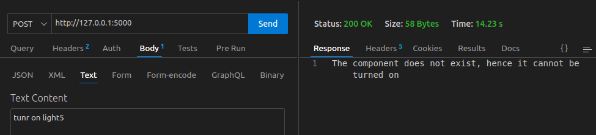
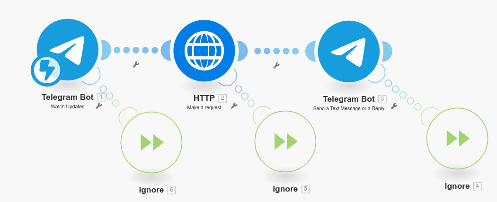
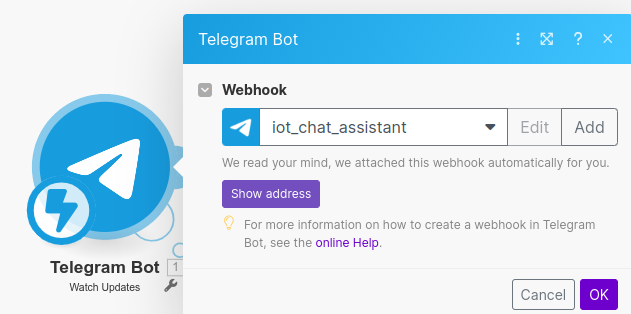
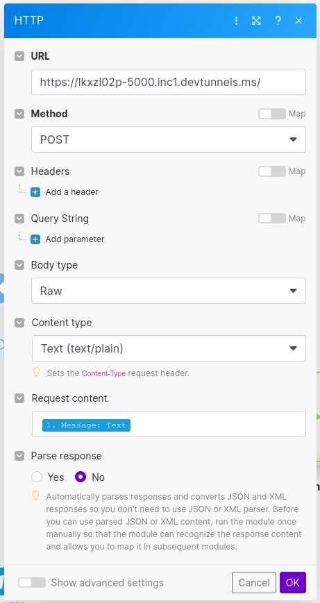
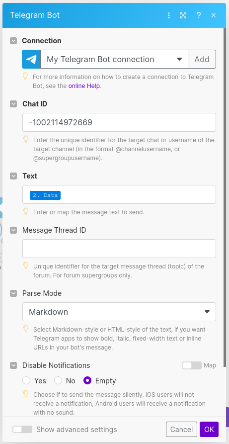

# Gemini_Powered_Personal_Assistant 🚀🚀🚀
Personal Assistant powered by LLM to execute task such as 
- 🌟 Control IOT Devices
- 🌐 Surf the Web
- 💬 General Conversation 
- 📰 Gathering News 
- 🔄 etc.

## Video
Will be updated soon......

## Screenshots
Will be updated soon......


## Prerequisites

1. Get API KEY for [Gemini 1.0 Pro](https://ai.google.dev/pricing)
2. Install the `server.py` and run the app
    - Test the server 
3. Create a bot in Telegram from BotFather
    - Add the Bot to the group
4. Make an account in [Make.com](https://eu2.make.com/ ) 
    - Make scenario in `Make.com`
    - Create Webhooks for Telegram Group Bot
5. Install Arduino IDE (extra step for demo purpose) 
    - Install libraries
    - Push the code `iot_gpt_webserver.ino` to `ESP8266`


## 1. Get API KEY for [Gemini 1.0 Pro](https://ai.google.dev/pricing)

[GEMINI 1.0 PRO](https://ai.google.dev/pricing) get the API KEY


## 2. Install the `server.py` and run the app

## Installation

Use the package manager [pip](https://pip.pypa.io/en/stable/) to install Personal Assistant.
```
pip install -r requirements.txt
```

## Running the application
```
python3 server.py
```
The server will run on 
http://127.0.0.1:5000

This link could be [port forwarded](https://code.visualstudio.com/docs/editor/port-forwarding) using VS-code.

Make the link public for interacting with webhooks

##     2.1 Test the server 

Using [ThunderClient](https://www.thunderclient.com/)
 make a `POST` request on http://127.0.0.1:5000 or the publicly forwarded port.

## 3. Create a bot in Telegram from BotFather

- Watch this video for better understanding [Youtube](https://www.youtube.com/watch?v=aNmRNjME6mE)

- Create a Telegram Account:
If you don't have one already, sign up for Telegram. You'll need an account to create a bot.

- Start a Chat with BotFather:
BotFather is the official bot provided by Telegram to create and manage bots. Search for "@BotFather" in the Telegram app and start a chat.

- Create a New Bot:
Type /newbot command to BotFather. It will ask you to choose a name for your bot and then provide a username for your bot. Once you've completed this step, BotFather will give you an API token for your bot. This token is essential for interacting with the Telegram Bot API.

- Keep the Token Secure:
Your bot's token is like a password. Keep it secure and don't share it with anyone you don't trust. This token allows others to control your bot.


##     3.1 Add the Bot to the group
Add the bot to the group

## 4. Make an account in [Make.com](https://eu2.make.com/ ) 
Make an account
##     4.1 Make scenario in `Make.com`
You can watch this [link](https://www.youtube.com/watch?v=X13CFfgMMAw&t=1s) to you started.

Below is a scenario for getting data from telegram and passing it to `server.py` and then passing the response back.

The ignore modules can be added for handling errors

Some key screenshots are also added for understanding the settings in each module. 


Create Webhook with telegram. Here you have to Provide the Secret Token of the BOT that you have saved earlier.
When a test message is written in the group note down the chatID. We will need it later.


Add the public forward ported url of the `server.py`.
The content type would be text.


Identify the chatID and add it to the field.



## 5. Install Arduino IDE (extra step for demo purpose) 
##    5.1 Install libraries
##    5.2 Push the code `iot_gpt_webserver.ino` to `ESP8266`


## Usage


## Contributing

Pull requests are welcome. For major changes, please open an issue first
to discuss what you would like to change.

Please make sure to update tests as appropriate.

## License

[MIT](https://choosealicense.com/licenses/mit/)
